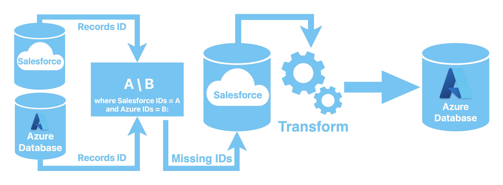

# Salesforce to Azure data backup #
A batch process which takes all sObject records from Salesforce (Data producer),
checks which of the records are missing in a Azure Database (Data consumer), and loads missing records.

